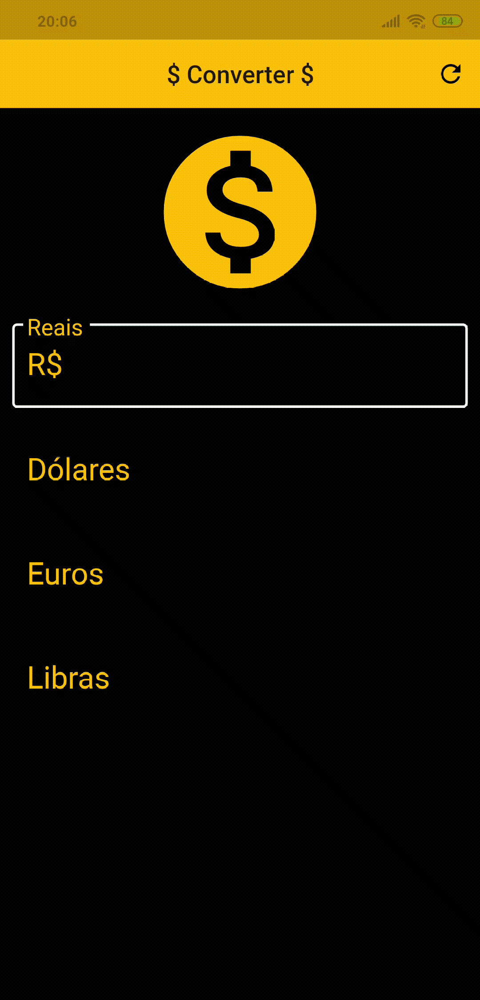

<h1 align="center">
  
 
Currency Converter
</h1>

This application is a very simple example consuming an api of values.

  

 

## Features

- **Flutter** — Flutter makes it easy and fast to build beautiful mobile apps
